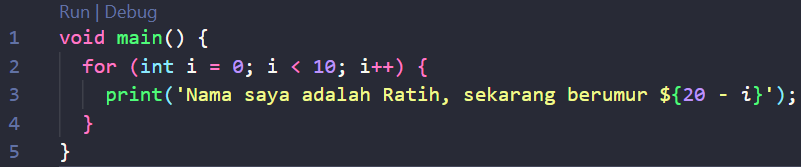
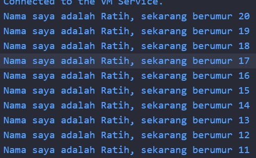

# Laporan Praktikum #02 - Pemrograman Dasar Dart - Bag.1 (Variabel dan Tipe Data)

## Identitas Mahasiswa

| Atribut | Nilai                   |
| ------- | ----------------------- |
| Nama    | Ratih Purnama Dewi      |
| NIM     | 244107060055            |
| Kelas   | SIB-2D                  |

---

## Tugas Praktikum 2

### Soal 1

Modifikasilah kode pada baris 3 di VS Code atau Editor Code favorit Anda berikut ini agar mendapatkan keluaran (output) sesuai yang diminta!

```dart
void main() {
  for (int i = 0; i < 10; i++) {
    print("Hello ${i + 2}");
  }
}
```

**Jawaban:**




---

### Soal 2

Mengapa sangat penting untuk memahami bahasa pemrograman Dart sebelum kita menggunakan framework Flutter? Jelaskan!

**Jawaban:**

Flutter adalah framework UI, tetapi Dart adalah fondasinya. Tanpa memahami Dart, membangun aplikasi Flutter akan terasa membingungkan dan sulit dikembangkan secara profesional.

---

### Soal 3

Rangkumlah materi dari codelab ini menjadi poin-poin penting yang dapat Anda gunakan untuk membantu proses pengembangan aplikasi mobile menggunakan framework Flutter.

**Jawaban:**
Berikut adalah rangkuman materi dari codelab yang dapat digunakan untuk membantu proses pengembangan aplikasi mobile menggunakan framework Flutter:

1. **Variabel**
   - Variabel adalah wadah untuk menyimpan nilai.
   - Variabel dideklarasikan menggunakan kata kunci `var`, `final`, atau `const`.
   - Variabel dapat menyimpan nilai dari berbagai tipe data, seperti integer, double, string, boolean, dan lain-lain.

2. **Tipe Data**
   - Tipe data adalah jenis data yang dapat disimpan dalam variabel.
   - Tipe data pada Dart meliputi: `int`, `double`, `String`, `bool`, `List`, `Map`, dan lain-lain.

3. **Null Safety**
   - Null safety adalah fitur yang diperkenalkan pada Dart 2.0 yang memungkinkan pengembang untuk menentukan apakah suatu variabel dapat bernilai null atau tidak.
   - Null safety mencegah kesalahan yang diakibatkan oleh akses variabel yang tidak disengaja yang bernilai null.

4. **Late Variabel**
   - Late variabel adalah fitur yang memungkinkan pengembang untuk menunda inisialisasi variabel sampai variabel tersebut digunakan.
   - Late keyword adalah kontrak antara pengembang dan dart. pengembang memberitahu dart bahwa variabel tersebut akan diinisialisasi sebelum digunakan. Jika variabel tersebut tidak diinisialisasi sebelum digunakan, maka akan terjadi kesalahan runtime.
     
---

### Soal 4

Buatlah penjelasan dan contoh eksekusi kode tentang perbedaan Null Safety dan Late variabel!

**Jawaban:**

#### Null Safety

Null Safety adalah fitur Dart yang mencegah variabel bernilai null secara tidak sengaja.

Sejak Dart 2.12, variabel tidak boleh null kecuali ditandai dengan ?.


Jika kode null safety dihilangkan, maka akan terjadi kesalahan compile karena variabel non-nullable tidak boleh tanpa nilai awal. Seperti hasil dibawah ini.


#### Late Variable

late digunakan untuk memberitahu Dart bahwa variabel akan diinisialisasi nanti, tapi dijamin sebelum dipakai.


Jika tidak diisi sebelum dipakai


