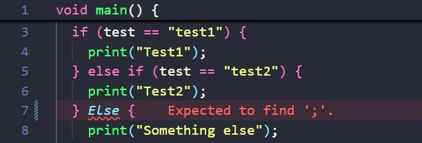
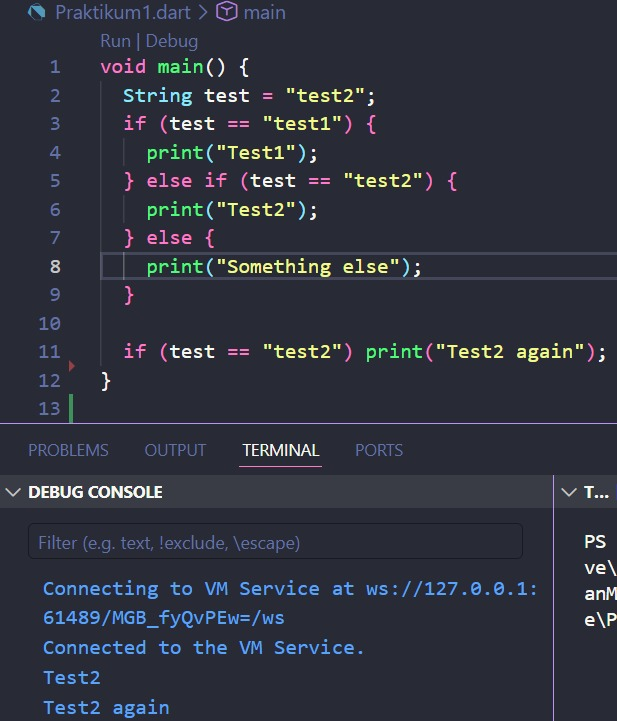
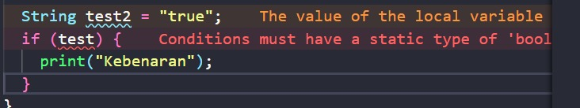
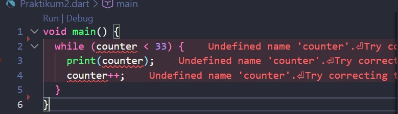
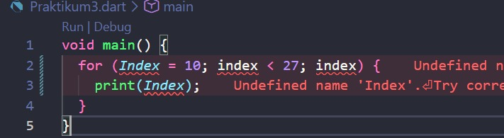
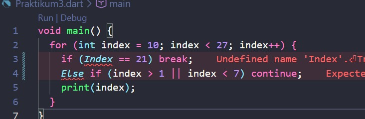
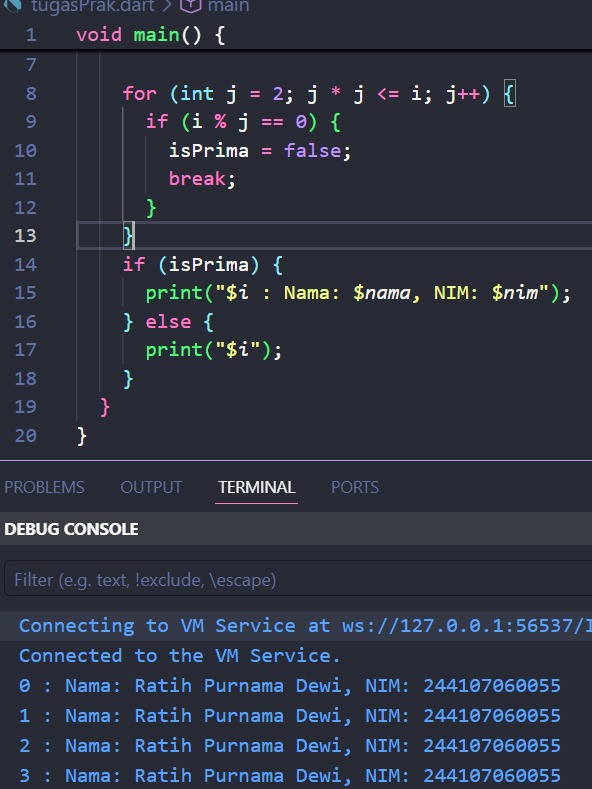

# Laporan Praktikum 03 - Pemrograman Dasar Dart - Bag.2 (Control Flows dan Perulangan

## Identitas Mahasiswa

| Atribut | Nilai                   |
| ------- | ----------------------- |
| Nama    | Ratih Purnama Dewi      |
| NIM     | 244107060055            |
| Kelas   | SIB-2D                  |

---

## Praktikum 1: Menerapkan Control Flows ("if/else")

### Langkah 1

Ketik atau salin kode program berikut ke dalam fungsi `main()`.

```dart
void main() {
  String test = "test2";
  if (test == "test1") {
    print("Test1");
  } else If (test == "test2") {
    print("Test2");
  } Else {
    print("Something else");
  }

  if (test == "test2") print("Test2 again");
}
```

### Langkah 2

Silakan coba eksekusi (Run) kode pada langkah 1 tersebut. Apa yang terjadi? Jelaskan!

**Jawaban:**



Kode pada langkah 1 mengalami **error** saat dieksekusi. Hal ini disebabkan karena penulisan keyword `If` dan `Else` menggunakan huruf kapital di awal. Dart bersifat **case-sensitive**, sehingga `If` dan `Else` tidak dikenali sebagai keyword yang valid. Penulisan yang benar adalah `if` dan `else` (seluruhnya huruf kecil).

Berikut kode yang sudah diperbaiki:

```dart
void main() {
  String test = "test2";
  if (test == "test1") {
    print("Test1");
  } else if (test == "test2") {
    print("Test2");
  } else {
    print("Something else");
  }

  if (test == "test2") print("Test2 again");
}
```

Output setelah diperbaiki:



### Langkah 3

Tambahkan kode program berikut, lalu coba eksekusi (Run) kode Anda.

```dart
String test = "true";
if (test) {
   print("Kebenaran");
}
```

**Jawaban:**

Kode di atas mengalami **2 error**. Pertama, variabel `test` sudah dideklarasikan sebelumnya pada langkah 1, sehingga terjadi **redeclaration error**. Kedua, kondisi `if` pada Dart **hanya menerima ekspresi bertipe `bool`**, sedangkan variabel `test` bertipe `String`. Tidak seperti JavaScript, Dart tidak melakukan konversi implisit dari `String` ke `bool`.



Berikut kode yang sudah diperbaiki agar tetap menggunakan `if/else`:

```dart
String test2 = "true";
if (test2 == "true") {
   print("Kebenaran");
}
```

Output setelah diperbaiki:


---

## Praktikum 2: Menerapkan Perulangan "while" dan "do-while"

### Langkah 1

Ketik atau salin kode program berikut ke dalam fungsi `main()`.

```dart
void main() {
  while (counter < 33) {
    print(counter);
    counter++;
  }
}
```

### Langkah 2

Silakan coba eksekusi (Run) kode pada langkah 1 tersebut. Apa yang terjadi? Jelaskan! Lalu perbaiki jika terjadi error.

**Jawaban:**



Kode di atas mengalami **error** karena variabel `counter` belum dideklarasikan. Dart mengharuskan setiap variabel dideklarasikan dengan tipe data atau keyword `var` sebelum digunakan. Selain itu, variabel `counter` juga perlu diinisialisasi dengan nilai awal agar perulangan `while` dapat berjalan.

Berikut kode yang sudah diperbaiki:

```dart
void main() {
  int counter = 0;
  while (counter < 33) {
    print(counter);
    counter++;
  }
}
```

Output setelah diperbaiki:


### Langkah 3

Tambahkan kode program berikut, lalu coba eksekusi (Run) kode Anda.

```dart
do {
  print(counter);
  counter++;
} while (counter < 77);
```

**Jawaban:**

Kode di atas pada perulangan `do-while` akan melanjutkan perulangan dari nilai `counter` terakhir pada perulangan `while`, yaitu `33`. Sehingga perulangan `do-while` akan berjalan dari `33` hingga `76`.

Kode dan Output:


---

## Praktikum 3: Menerapkan Perulangan "for" dan "break-continue"

### Langkah 1

Ketik atau salin kode program berikut ke dalam fungsi `main()`.

```dart
void main() {
  for (Index = 10; index < 27; index) {
    print(Index);
  }
}
```

### Langkah 2

Silakan coba eksekusi (Run) kode pada langkah 1 tersebut. Apa yang terjadi? Jelaskan! Lalu perbaiki jika terjadi error.

**Jawaban:**

Kode di atas mengalami **beberapa error**:



1. Variabel `Index` dan `index` tidak konsisten, bahasa pemrograman Dart bersifat **case sensitive**, sehingga `Index` dan `index` dianggap sebagai dua variabel yang berbeda.
2. Variabel `index` belum dideklarasikan dengan tipe data.
3. Bagian increment `index` seharusnya `index++` agar nilai bertambah setiap iterasi. Jika tanpa increment, perulangan akan berjalan tanpa henti (**infinite loop**) dan memakan banyak memori.

Berikut kode yang sudah diperbaiki:

```dart
void main() {
  for (int index = 10; index < 27; index++) {
    print(index);
  }
}
```
Output Setelah Diperbaiki:


### Langkah 3

Tambahkan kode program berikut di dalam `for-loop`, lalu coba eksekusi (Run) kode Anda.

```dart
If (Index == 21) break;
Else If (index > 1 || index < 7) continue;
print(index);
```

**Jawaban:**



Kode di atas mengalami **error** karena:

1. Penulisan `If` dan `Else If` menggunakan huruf kapital — seharusnya `if` dan `else if` (huruf kecil).
2. Variabel `Index` seharusnya `index` (konsisten huruf kecil) mengikuti nama variabel yang telah dideklarasikan pada langkah 2.

Berikut kode lengkap yang sudah diperbaiki:

```dart
void main() {
  for (int index = 10; index < 27; index++) {
    if (index == 21) break;
    else if (index > 1 || index < 7) continue;
    print(index);
  }
}
```

Karena kondisi `index > 1 || index < 7` akan selalu bernilai `true` (karena `index` dimulai dari `10`, maka `index > 1` selalu `true`), maka `continue` akan selalu dieksekusi dan `print(index)` tidak akan pernah tercetak. Perulangan berhenti saat `index == 21` karena `break`.

Output Setelah Diperbaiki:

   

## Tugas: Buatlah sebuah program yang dapat menampilkan bilangan prima dari angka 0 sampai 201 menggunakan Dart. Ketika bilangan prima ditemukan, maka tampilkan nama lengkap dan NIM Anda.

**Jawaban:**

```dart
void main() {
  String nama = "Dimas Adit Thalia Putra";
  String nim = "244107060037";

  for (int i = 0; i <= 201; i++) {
    bool isPrima = true;

    for (int j = 2; j * j <= i; j++) {
      if (i % j == 0) {
        isPrima = false;
        break;
      }
    }

    if (isPrima) {
      print("$i : Nama: $nama, NIM: $nim");
    } else {
      print("$i");
    }
  }
}
```

Output:


