# Laporan Praktikum #04 | Pengantar Bahasa Pemrograman Dart - Bagian 3

## Identitas Mahasiswa

| Atribut | Nilai                        |
| ------- | -----                        |
| Nama    | Ratih Purnama Dewi           |
| NIM     | 244107060055                 |
| Kelas   | SIB-2D                       |
---

# Tugas Praktikum 4
# Soal 1
Silakan selesaikan Praktikum 1 sampai 5, lalu dokumentasikan berupa screenshot hasil pekerjaan Anda beserta penjelasannya!

## Praktikum 1: Eksperimen Tipe Data List

Selesaikan langkah-langkah praktikum berikut ini menggunakan VS Code atau Code Editor favorit Anda.

**Langkah 1:**

Ketik atau salin kode program berikut ke dalam `void main()`.

```dart
var list = [1, 2, 3];
assert(list.length == 3);
assert(list[1] == 2);
print(list.length);
print(list[1]);

list[1] = 1;
assert(list[1] == 1);
print(list[1]);
```

**Langkah 2:**

Silakan coba eksekusi (Run) kode pada langkah 1 tersebut. Apa yang terjadi? Jelaskan!

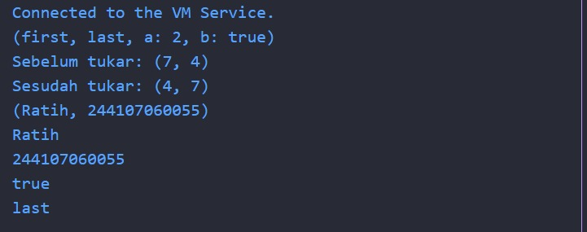

Kode tersebut berhasil dijalankan, memperlihatkan proses membaca dan mengubah isi list di Dart, serta menggunakan assert untuk memastikan kondisi yang diinginkan benar pada saat eksekusi.

**Langkah 3:**

Ubah kode pada langkah 1 menjadi variabel final yang mempunyai index = 5 dengan default value = `null`. Isilah nama dan NIM Anda pada elemen index ke-1 dan ke-2. Lalu print dan capture hasilnya.

Apa yang terjadi? Jika terjadi error, silakan perbaiki.

Coden & Output

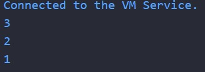


## Praktikum 2: Eksperimen Tipe Data Set

Selesaikan langkah-langkah praktikum berikut ini menggunakan VS Code atau Code Editor favorit Anda.

**Langkah 1:**

Ketik atau salin kode program berikut ke dalam fungsi `main()`.

```dart
var halogens = {'fluorine', 'chlorine', 'bromine', 'iodine', 'astatine'};
print(halogens);
```

**Langkah 2:**

Silakan coba eksekusi (Run) kode pada langkah 1 tersebut. Apa yang terjadi? Jelaskan! Lalu perbaiki jika terjadi error.

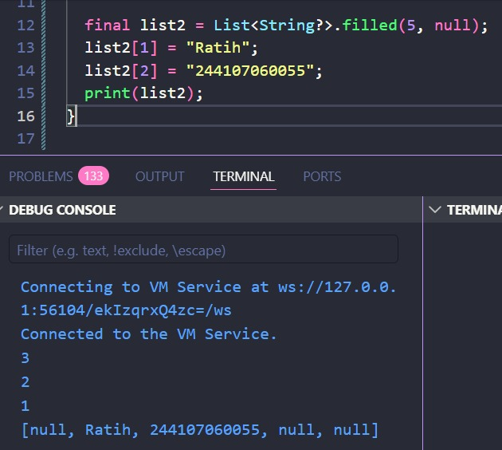

Kode tersebut mendeklarasikan sebuah variabel bernama halogens yang bertipe Set karena menggunakan tanda kurung kurawal {} tanpa pasangan key-value ":", kemudian kode tersebut mencetak isi set ke konsol dan tidak terdapat error pada kode tersebut.

**Langkah 3:**

Tambahkan kode program berikut, lalu coba eksekusi (Run) kode Anda.

```dart
var names1 = <String>{};
Set<String> names2 = {}; // This works, too.
var names3 = {}; // Creates a map, not a set.

print(names1);
print(names2);
print(names3);
```

Apa yang terjadi? Jika terjadi error, silakan perbaiki namun tetap gunakan ketiga variabel tersebut. Tambahkan elemen nama dan NIM Anda pada kedua variabel Set tersebut dengan dua fungsi berbeda yaitu `.add()` dan `.addAll()`. Untuk variabel Map dihapus, nanti kita coba di praktikum selanjutnya.

Dokumentasikan kode dan hasil di console, lalu buat laporannya.

Code & Output

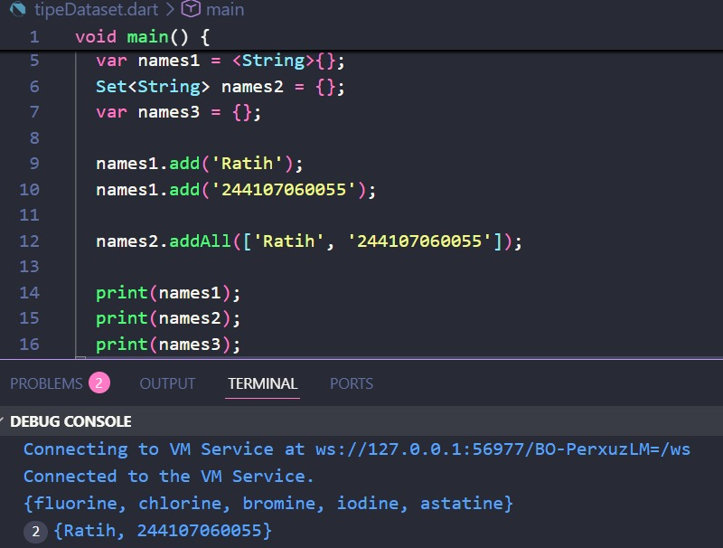


## Praktikum 3: Eksperimen Tipe Data Maps

Selesaikan langkah-langkah praktikum berikut ini menggunakan VS Code atau Code Editor favorit Anda.

**Langkah 1:**

Ketik atau salin kode program berikut ke dalam fungsi `main()`.

```dart
var gifts = {
  // Key:   Value
  'first': 'partridge',
  'second': 'turtledoves',
  'fifth': 1
};

var nobleGases = {
  2: 'helium',
  10: 'neon',
  18: 2,
};

print(gifts);
print(nobleGases);
```

**Langkah 2:**

Silakan coba eksekusi (Run) kode pada langkah 1 tersebut. Apa yang terjadi? Jelaskan! Lalu perbaiki jika terjadi error.

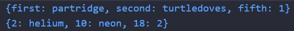

kode berhasil dijalankan dan mencetak isi Map gifts dan nobleGases ke layar tanpa error karena Dart mendukung Map dengan tipe data dinamis.

**Langkah 3:**

Tambahkan kode program berikut, lalu coba eksekusi (Run) kode Anda.

```dart
var mhs1 = Map<String, String>();
gifts['first'] = 'partridge';
gifts['second'] = 'turtledoves';
gifts['fifth'] = 'golden rings';

var mhs2 = Map<int, String>();
nobleGases[2] = 'helium';
nobleGases[10] = 'neon';
nobleGases[18] = 'argon';
```

Apa yang terjadi? Jika terjadi error, silakan perbaiki.

data fifth pada gifts yang awalnya '1' berubah jadi 'golden rings', dan data 18 pada nobleGases yang awalnya '2' berubah jadi 'argon' 
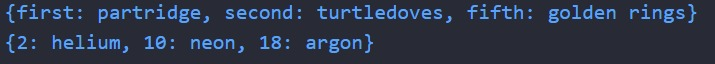

Tambahkan elemen nama dan NIM Anda pada tiap variabel di atas (`gifts`, `nobleGases`, `mhs1`, dan `mhs2`).
Dokumentasikan hasilnya dan buat laporannya.

Codenya
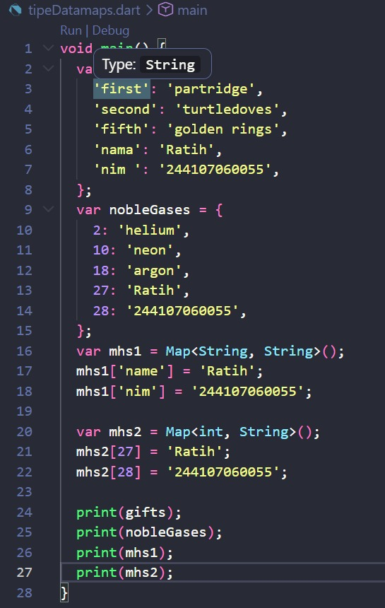

Outputnya
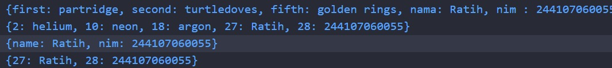

## Praktikum 4: Eksperimen Tipe Data List: Spread dan Control-flow Operators

Selesaikan langkah-langkah praktikum berikut ini menggunakan VS Code atau Code Editor favorit Anda.

**Langkah 1:**

Ketik atau salin kode program berikut ke dalam fungsi `main()`.

```dart
var list = [1, 2, 3];
var list2 = [0, ...list];
print(list1);
print(list2);
print(list2.length);
```

**Langkah 2:**

Silakan coba eksekusi (Run) kode pada langkah 1 tersebut. Apa yang terjadi? Jelaskan! Lalu perbaiki jika terjadi error.

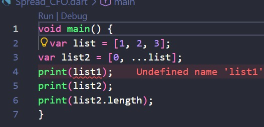

Terjadi error karena list 1 tidak ada, perbaikannya yaitu mengubah list1 menjadi list

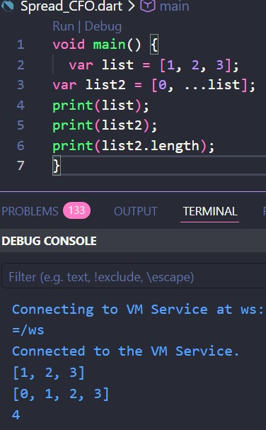

**Langkah 3:**

Tambahkan kode program berikut, lalu coba eksekusi (Run) kode Anda.

```dart
list1 = [1, 2, null];
print(list1);
var list3 = [0, ...?list1];
print(list3.length);
```

Apa yang terjadi? Jika terjadi error, silakan perbaiki.

Terjadi error karena belum ada deklarasi 'var' di awal list1


Perbaikannya yaitu dengan menambahakan var di list1

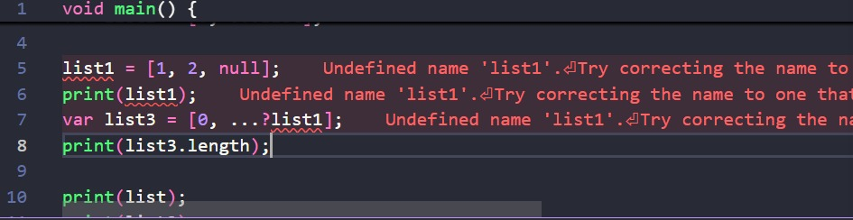

Tambahkan variabel list berisi NIM Anda menggunakan Spread Operators. Dokumentasikan hasilnya dan buat laporannya.

Code & Output

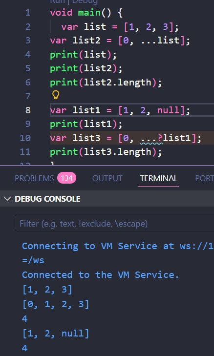


**Langkah 4:**

Tambahkan kode program berikut, lalu coba eksekusi (Run) kode Anda.

```dart
var nav = ['Home', 'Furniture', 'Plants', if (promoActive) 'Outlet'];
print(nav);
```

Apa yang terjadi? Jika terjadi error, silakan perbaiki. Tunjukkan hasilnya jika variabel `promoActive` ketika `true` dan `false`.

Error karena var promoActive belum di deklarasikan

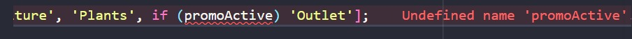

Solusinya mendeklarasikan var promoActive
Outpunya jika promoActive True


Outpunya jika promoActive False

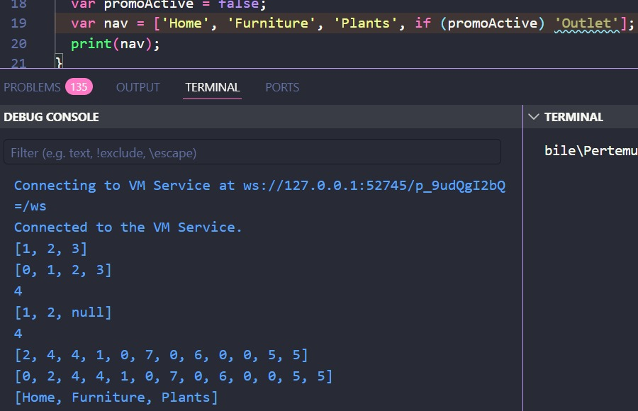

**Langkah 5:**

Tambahkan kode program berikut, lalu coba eksekusi (Run) kode Anda.

```dart
var nav2 = ['Home', 'Furniture', 'Plants', if (login case 'Manager') 'Inventory'];
print(nav2);
```

Apa yang terjadi? Jika terjadi error, silakan perbaiki. Tunjukkan hasilnya jika variabel `login` mempunyai kondisi lain.

Error karena var login belum di deklarasikan

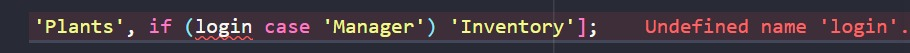

Solusinya mendeklarasikan var Login dengan nilainya adalah manager
Outpunya jika Login nilainya manager

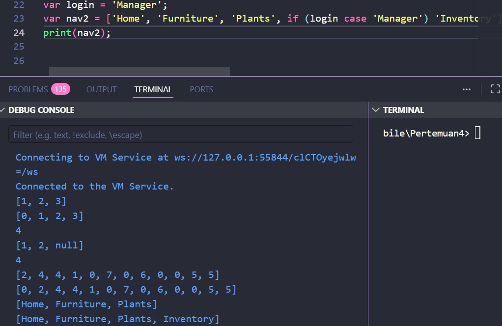

Code dan output jika Login nilainya selain manager(user)


**Langkah 6:**

Tambahkan kode program berikut, lalu coba eksekusi (Run) kode Anda.

```dart
var listOfInts = [1, 2, 3];
var listOfStrings = ['#0', for (var i in listOfInts) '#$i'];
assert(listOfStrings[1] == '#1');
print(listOfStrings);
```

Apa yang terjadi? Jika terjadi error, silakan perbaiki. Jelaskan manfaat **Collection For** dan dokumentasikan hasilnya.

Tidak terjadi error

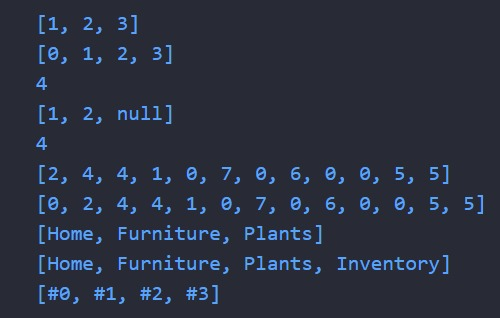

Collection For pada Dart memungkinkan penambahan elemen ke koleksi (list/set/map) secara langsung menggunakan perulangan di dalam deklarasi, sehingga kode lebih ringkas dan mudah dibaca dibandingkan menambah elemen list menggunakan loop di luar deklarasi

## Praktikum 5: Eksperimen Tipe Data Records

**Langkah 1:**

Ketik atau salin kode program berikut ke dalam fungsi `main()`.

```dart
var record = ('first', a: 2, b: true, 'last');
print(record);
```

**Langkah 2:**

Silakan coba eksekusi (Run) kode pada langkah 1 tersebut. Apa yang terjadi? Jelaskan! Lalu perbaiki jika terjadi error.

Code & Output

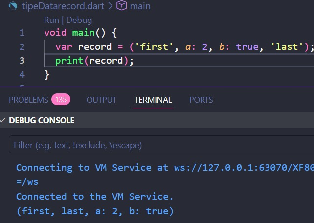

Program akan menampilkan seluruh isi record ke layar, yaitu 'first' dan 'last' sebagai data berurutan, serta a: 2 dan b: true sebagai data bernama.

**Langkah 3:**

Tambahkan kode program berikut di luar scope `void main()`, lalu coba eksekusi (Run) kode Anda.

```dart
(int, int) tukar((int, int) record) {
  var (a, b) = record;
  return (b, a);
}
```
Apa yang terjadi? Jika terjadi error, silakan perbaiki. Gunakan fungsi `tukar()` di dalam `main()` sehingga tampak jelas proses pertukaran value field di dalam Record.

Tidak ada error, tetapi outpunya masih sama seperti no 2

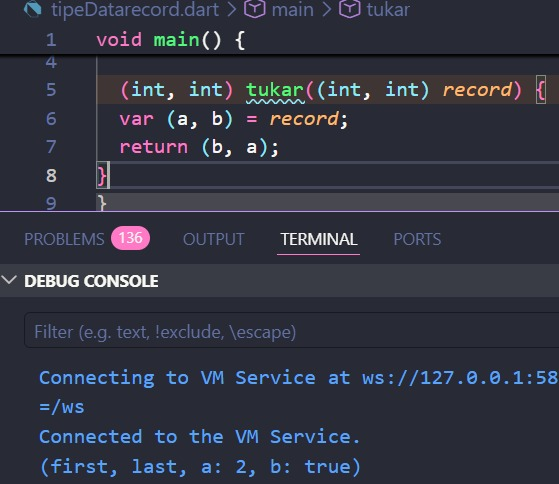

Setelah menggunakan fungsi tukar dalam main, codenya begini

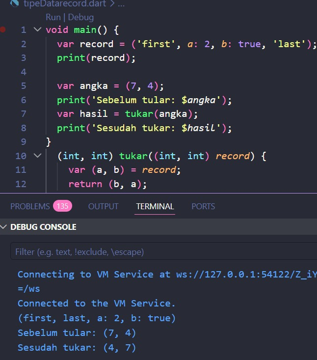

**Langkah 4:**

Tambahkan kode program berikut di dalam scope `void main()`, lalu coba eksekusi (Run) kode Anda.

```dart
// Record type annotation in a variable declaration:
(String, int) mahasiswa;
print(mahasiswa);
```
Apa yang terjadi? Jika terjadi error, silakan perbaiki. Inisialisasi field nama dan NIM Anda pada variabel record `mahasiswa` di atas. Dokumentasikan hasilnya dan buat laporannya!

Terjadi error karena data mahasiswa belum di isi

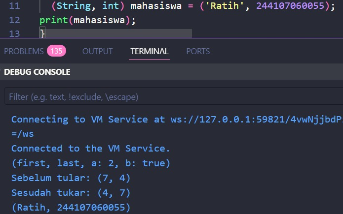


**Langkah 5:**

Tambahkan kode program berikut di dalam scope `void main()`, lalu coba eksekusi (Run) kode Anda.

```dart
var mahasiswa2 = ('first', a: 2, b: true, 'last');
print(mahasiswa2.$1); // Prints 'first'
print(mahasiswa2.a); // Prints 2
print(mahasiswa2.b); // Prints true
print(mahasiswa2.$2); // Prints 'last'
```
Apa yang terjadi jika terjadi error, silakan perbaiki. Gantilah salah satu isi record dengan nama dan NIM Anda, lalu dokumentasikan hasilnya dan buat laporannya!

Tidak terjadi error, output sesuai dengan contoh

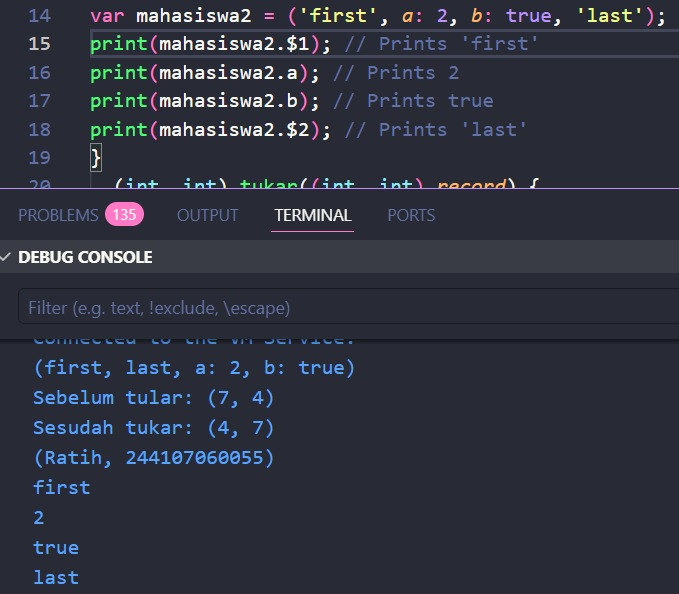

Kode dan Output setelah satu record di ganti nama dan nim

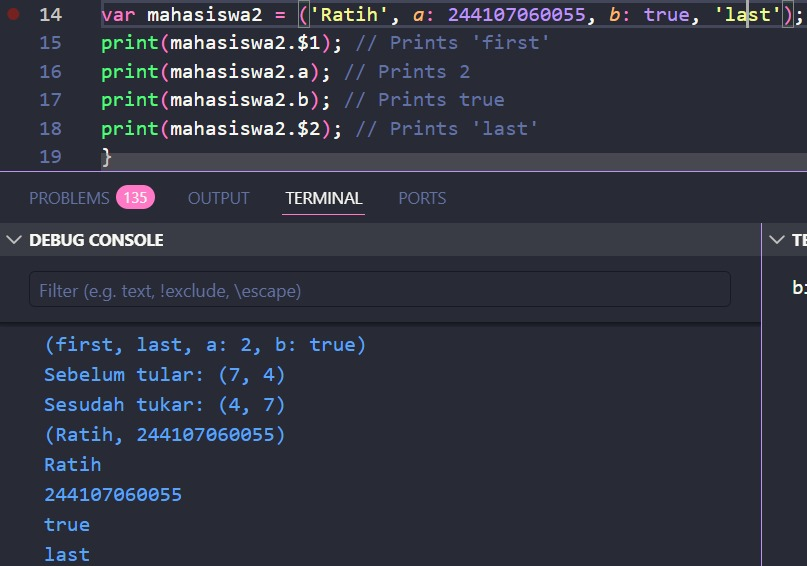


# Soal 2
Jelaskan yang dimaksud Functions dalam bahasa Dart!

Jawab:<br>
Functions di Dart adalah blok kode yang bisa dipanggil/digunakan berkali-kali untuk melakukan tugas tertentu. Functions menerima input (parameter), menjalankan instruksi, dan bisa mengembalikan output/return value.

# Soal 3
Jelaskan jenis-jenis parameter di Functions beserta contoh sintaksnya!

Jawab: <br>
a. Positional Parameters (wajib urutan dan jumlahnya)
```dart
void mhs(String nama, int nim) {
  print('Nama $nama, Nim $nim');
}
```

b. Optional Positional Parameters (opsional, pakai [ ])

```dart
void infoMhs(String nama, [String? jurusan]) {
  print('Nama: $nama, Hobi: $jurusan');
}
```

c. Named Parameters (opsional/harus disebut nama kuncinya, pakai { })

```dart
void biodata({required String nama, int? umur}) {
  print('Nama: $nama, Umur: $umur');
}
```

d. Default Value pada Parameter

```dart
void salam({String pesan = 'Pagiii'}) {
  print(pesan);
}
```

# Soal 4
Jelaskan maksud Functions sebagai first-class objects beserta contoh sintaknya!

Jawab:<br>
Functions sebagai first-class objects artinya function dapat digunakan seperti data pada umumnya seperti bisa disimpan dalam variabel, dikirim sebagai parameter, dikembalikan dari function lain, serta dimanipulasi sesuai kebutuhan.

contoh
```dart
void sapa(String nama) {
  print('Halo $nama');
}

void fungsiPenerima(void Function(String) n) {
  n('Dart');
}

void main() {
  var n = sapa;        // menyimpan function ke variabel
  n('Nanda');         // memanggil function lewat variabel
  fungsiPenerima(sapa); // mengirim function sebagai parameter
}
```

# Soal 5
Apa itu Anonymous Functions? Jelaskan dan berikan contohnya!

Jawab:<br>
Anonymous Functions adalah function yang tidak memiliki nama. Biasanya digunakan untuk keperluan singkat, seperti pada parameter fungsi, callback, atau operasi koleksi.

contoh
``` dart
var list = [1, 2, 3];
list.forEach((item) {
  print(item);
});
```

# Soal 6
Jelaskan perbedaan Lexical scope dan Lexical closures! Berikan contohnya!

Jawab: <br>
a. Lexical scope adalah batasan akses variabel berdasarkan posisi penulisan kode
``` dart
void main(){
  var nama = 'Nanda';
  void sapa(){
    print(nama);
  }
  sapa(); 
}
```
b. Lexical closures adalah fungsi yang membawa variabel dari scope tempat yang dia dibuat, bahkan ketika sudah keluar dari scope aslinya
``` dart
Function createPrinter() {
  int x = 100;
  return () {
    print(x);
  };
}

void main() {
  var printer = createPrinter();
  printer();
}
```

# Soal 7
Jelaskan dengan contoh cara membuat return multiple value di Functions!

Jawab: <br>
Pada dart kita bisa mengembalikan lebih dari satu nilai dengan menggunakan List atau Map.

Contohnya yaitu
a. Menggunakan Return List
``` dart
List<int> getAngka() {
  return [10, 20];
}

void main() {
  var hasil = getAngka();
  print(hasil[0]);
  print(hasil[1]); 
}
```

b. Menggunakan Return Maps
``` dart
Map<String, String> getNama() {
  return {'depan': 'Nanda', 'belakang': 'Ricco'};
}

void main() {
  var nama = getNama();
  print(nama['depan']);
  print(nama['belakang']);
}
```
